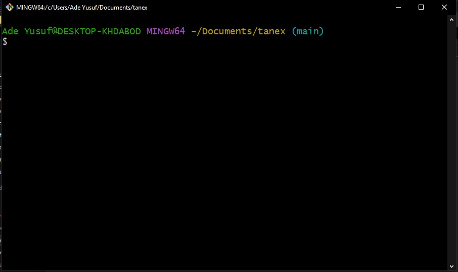
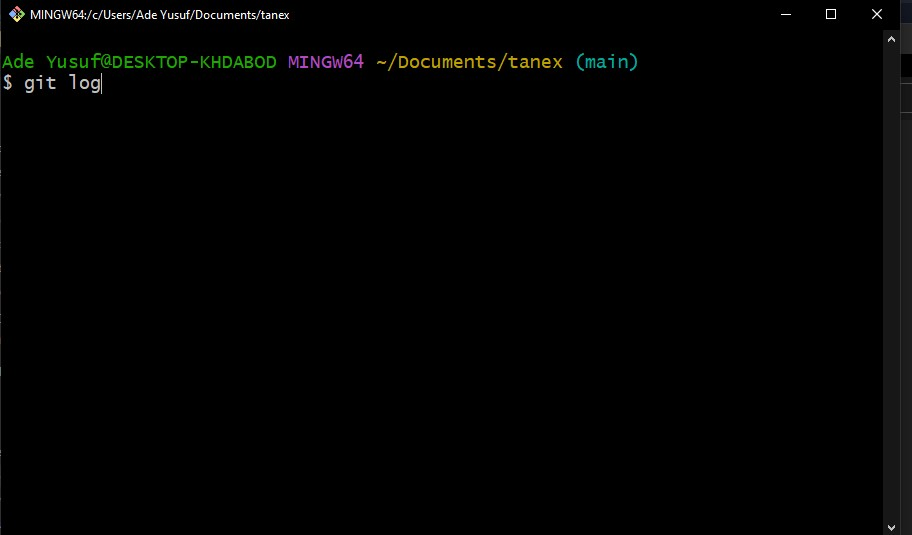
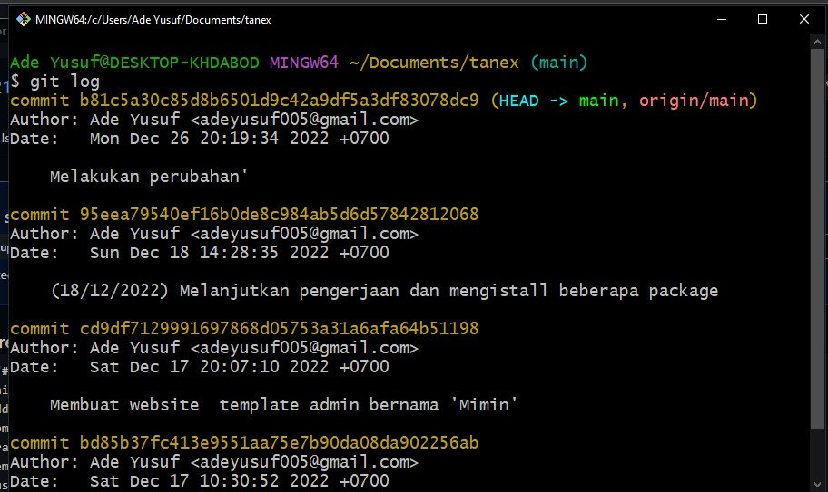
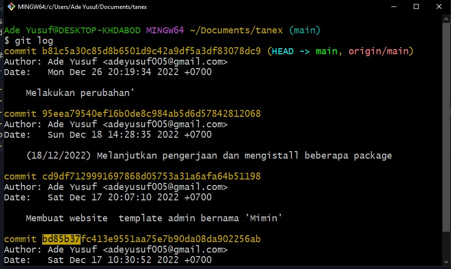
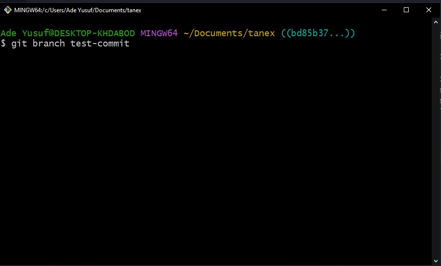
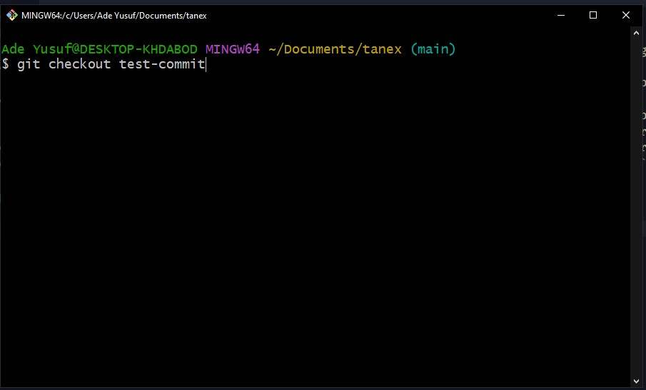
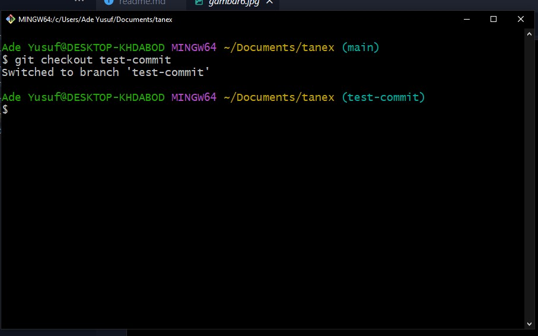

# BAGAIMANA CARA KEMBALI KE COMMIT TERTENTU / SEBELUMNYA PADA GITHUB?

Jika kamu sedang membutuhkan tutorial untuk kembali ke commit tertentu atau commit-commit sebelumnya di github, maka postingan ini sangat cocok untukmu.

Kembali ke sebuah commit yang _spesifik_ memang terkadang di butuhkan apabila kita sebagai developer menghadapi sebuah masalah seperti error atau tiba-tiba ada fitur yang tidak berjalan padahal sebelumnya berjalan lancar dan sebagainya. Terkadang hal ini membingungkan bagi seorang developer, padahal solusinya sangat mudah yaitu kita cukup kembali ke commit sebelumnya atau ke commit yang dimana fitur tadi berjalan dengan baik.

### BAGAIMANA CARANYA?
_ok, langsung saja kita mulai_

- 1. Buka terminal kalian (bisa pakai git, cmd atau apapun sesuai keinginanmu)
- 2. Arahkan terminal pada **projek** yang ingin dibuka
.
- 3. Jika sudah di arahkan pada projek yang telah di tentukan, silahkan ketik `git log` lalu tekan Enter
.
- 4. Setelah itu, kita akan ditampilkan history seluruh commit yang pernah dibuat beserta dengan _id_ berupa angka dan huruf random sebagai pembeda dari tiap commitnya.
.
- 5. Untuk kembali ke commit yang kamu inginkan, kamu cukup ambil 7 digit pertama dari _id_ tadi.
.
- 6. Setelah itu, kamu tinggal mengetikkan perintah "git checkout (7digitkodepertama)", contoh: `git checkout bd85b37`
.
- 7. Setelah kamu mengetikkan perintah tersebut, maka git akan otomatis membuka commit yang kamu tentukan tadi (lihat di pojok kanan, jika yang ditampilkan adalah angka / huruf random maka itu artinya kamu telah berhasil masuk ke commit yang kamu inginkan).
- 8. Lalu, setelah kamu masuk kedalam commit (bukan branch) kamu tinggal membuat _branch_ baru dari commit yang telah terbuka tadi. Misal `git branch test-commit`
.
- 9. Setelah mengetikkan perintah tersebut, maka otomatis kamu akan dibuatkan branch baru bernama _test-commit_ dari commitan yang kamu inginkan. Namun kamu tidak akan langsung masuk / diarahkan ke branch tersebut. Untuk masuk kedalam branch   _test-commit_ tadi, kamu tinggal checkout saja ke branch tersebut dengan mengetikkan perintah "git checkout (namabranch)", contoh: `git checkout test-commit`
.
- 10. Selesai, kamu telah kembali ke commit yang kamu inginkan, setelah itu kamu bebas mau melakukan apapun sesuai yang kamu inginkan dari codingan yang ada di commit tersebut.
.

NAH, DEMIKIANLAH CARA BAGAIMANA KEMBALI KE COMMIT TERTENTU / SEBELUMNYA DI GITHUB. SEMOGA MEMBANTU.
Terimakasih...😊

